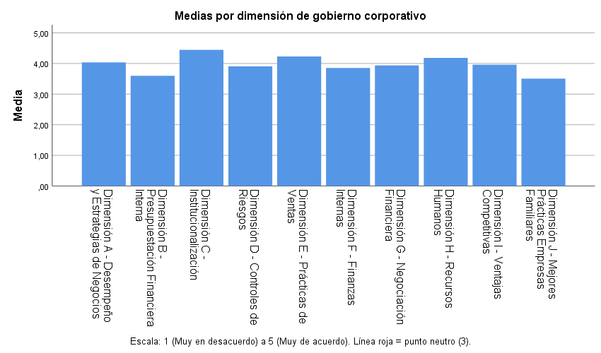
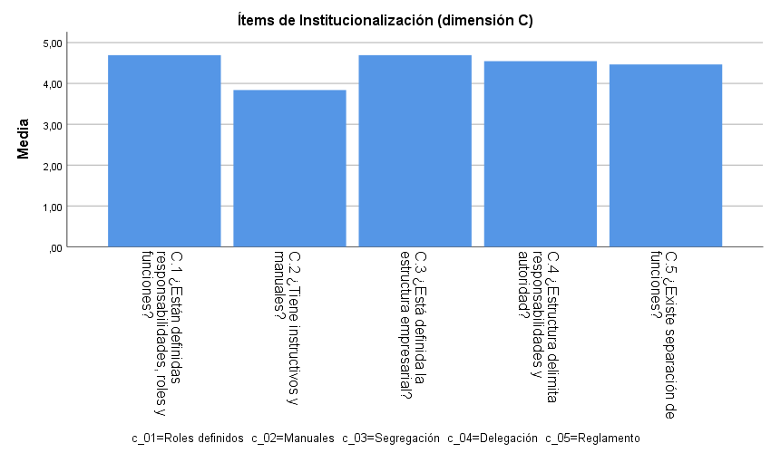
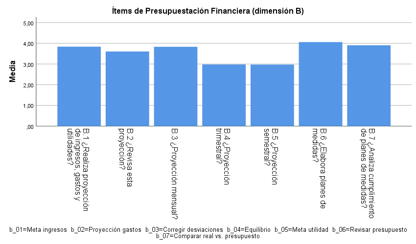
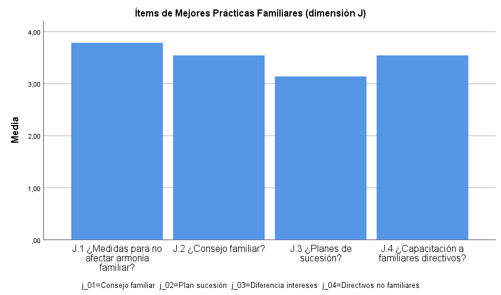
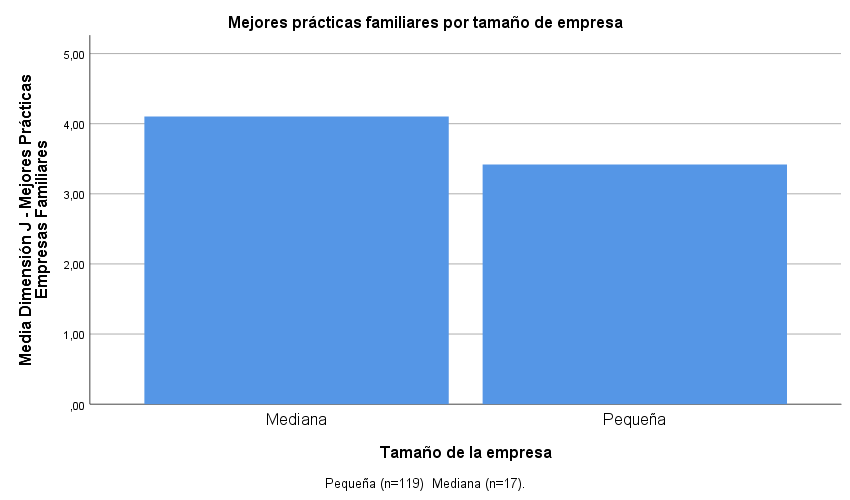
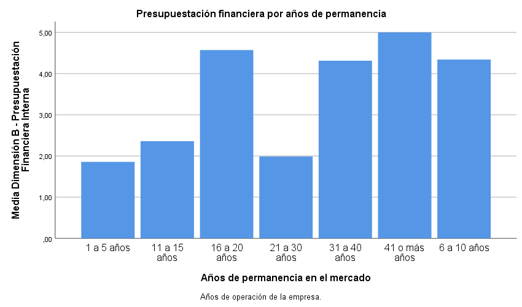

# Gobierno Corporativo y Permanencia de las PYMES en Autlán de Navarro, Jalisco: Un Diagnóstico Empírico

## Resumen

El objetivo de este estudio es analizar las prácticas de gobierno corporativo en 136 pequeñas y medianas empresas del municipio de Autlán de Navarro, Jalisco, y su relación con la permanencia en el mercado. Mediante un diseño cuantitativo, no experimental y transversal, se aplicó un cuestionario estructurado que evalúa diez dimensiones del gobierno corporativo con escala Likert de 5 puntos. Los resultados indican que la escala global presenta una consistencia interna excelente (α = 0.949) y que todas las dimensiones superan significativamente el punto neutro de la escala (p < 0.001). La institucionalización destaca como la dimensión con mayor puntaje (media = 4.45), mientras que las mejores prácticas de empresas familiares (media = 3.50) y la presupuestación financiera (media = 3.60) constituyen las áreas de mayor oportunidad. Se propone un plan de acción priorizado para fortalecer las prácticas de gobierno corporativo y aminorar la muerte prematura de este tipo de empresas.

**Palabras clave:** gobierno corporativo, PYMES, permanencia empresarial, Autlán de Navarro, diagnóstico.

**Clasificación JEL:** G32, G34, L26.

## 1. Introducción

Las pequeñas y medianas empresas (PYMES) constituyen un pilar fundamental de la economía mexicana, tanto por su contribución al producto interno bruto como por su capacidad de generación de empleo. Sin embargo, enfrentan una alta tasa de mortalidad prematura: cerca del 70% de las empresas fracasa durante los primeros cinco años de existencia (Arango Medina, 2022), atribuida en gran medida a debilidades en sus prácticas de gobierno corporativo. En el municipio de Autlán de Navarro, Jalisco, no se han localizado estudios sistemáticos que diagnostiquen las prácticas de gobierno corporativo y su relación con la permanencia de las PYMES, lo que limita el diseño de intervenciones para mejorar su sostenibilidad.

La presente investigación tiene como objetivo general describir y diagnosticar las prácticas de gobierno corporativo de las PYMES de Autlán de Navarro y su relación con la permanencia en el mercado, a partir de la evaluación de diez dimensiones: desempeño y estrategias de negocios, presupuestación financiera interna, institucionalización, controles de riesgos, prácticas de ventas, finanzas internas, negociación financiera, recursos humanos, ventajas competitivas y mejores prácticas de empresas familiares.

Como objetivos específicos se plantean: (a) indagar sobre los elementos que han limitado la permanencia funcional de las PYMES en el largo plazo, con énfasis en el gobierno corporativo, y (b) identificar las dimensiones de gobierno corporativo con menor puntaje como áreas de oportunidad y proponer un plan de acción para fortalecer la permanencia empresarial.

La hipótesis de trabajo plantea que la identificación y caracterización de las prácticas de gobierno corporativo en las PYMES de Autlán de Navarro permite discriminar dimensiones fuertes y débiles, y que esta discriminación posibilita la elaboración de un plan de acción encaminado a aminorar la muerte prematura de este tipo de empresas. La hipótesis se evalúa mediante pruebas de concordancia (W de Kendall) y de significación contra el punto neutro de la escala (prueba t para una muestra).

## 2. Marco Teórico

### 2.1 Gobierno corporativo: definición y evolución

El gobierno corporativo (GC) se define como el conjunto de principios, normas y procedimientos que regulan la estructura y el funcionamiento de los órganos de gobierno de una empresa, estableciendo las relaciones entre los accionistas, el consejo de administración, la dirección y los grupos de interés (*stakeholders*). Su propósito fundamental es asegurar una gestión eficiente, transparente y alineada con los objetivos de largo plazo de la organización (Vieira-Salazar, 2020).

Tradicionalmente, los modelos de GC se desarrollaron para grandes corporaciones que cotizan en bolsa, con énfasis en la separación entre propiedad y control y la protección del accionista minoritario (Torres-Cano, 2021). Sin embargo, en las últimas dos décadas ha crecido el interés por extender estos principios a las PYMES, reconociendo que un buen GC puede contribuir a su sostenibilidad y permanencia en el mercado (Abor & Adjasi, 2007).

### 2.2 Gobierno corporativo en PYMES

Las PYMES presentan características que diferencian su gobierno del de las grandes empresas: concentración de la propiedad en manos del fundador o la familia, superposición entre propiedad y gestión, estructuras organizacionales informales y limitados recursos para implementar mecanismos formales de control (Vieira-Salazar, 2020; Arango Medina, 2022). Estas particularidades exigen modelos de GC adaptados, que prioricen la profesionalización de la gestión y la implementación de controles internos básicos (Correa Monsalve, 2022).

Estudios recientes indican que la adopción de prácticas de GC en PYMES, aunque incipiente, produce efectos positivos en el desempeño. Botero, López y Gómez-Betancourt (2020), en una investigación con 2,287 PYMES familiares de 24 países latinoamericanos, encontraron que el uso de mecanismos formales de gobierno empresarial se relaciona positivamente con el desempeño financiero. Arango Medina (2022) reporta hallazgos similares en PYMES colombianas.

### 2.3 Gobierno corporativo en América Latina

En el contexto latinoamericano, el GC adquiere una relevancia particular debido a las debilidades institucionales, la concentración de la propiedad y la prevalencia de empresas familiares (Saavedra Najar, 2024). La región enfrenta desafíos como la falta de transparencia y altos costos de agencia (Santiago-Castro & Brown, 2007). Torres-Cano (2021) demostró que prácticas adecuadas de GC —como la no dualidad del CEO y un tamaño moderado del consejo— inciden positivamente en el valor de las empresas del Mercado Integrado Latinoamericano.

Cotrina Salvatierra et al. (2025) documentan una relación positiva entre la adherencia a principios de GC y la rentabilidad empresarial en América Latina, con evidencia de Brasil, Chile, México, Colombia, Ecuador y Perú. Sánchez-Vidal, Cegarra-Navarro y Martínez-Martínez (2026), mediante un análisis con 1,796 observaciones de la red FAEDPYME, identificaron que el GC sólido constituye un factor jerárquicamente significativo para el desarrollo sostenible de las MIPYMES iberoamericanas.

### 2.4 Gobierno corporativo y permanencia empresarial

La relación entre GC y permanencia empresarial ha sido documentada por diversos autores. Abor y Adjasi (2007) encontraron que las prácticas de GC representan una mayor probabilidad de supervivencia a largo plazo. En México, Polo, García y Hernández (2023) reportan una relación positiva entre las prácticas de GC y la rentabilidad financiera. Martínez y Ríos (2020), en un estudio publicado en *Estudios Gerenciales*, proponen un modelo multidimensional para evaluar el GC en PYMES del occidente de México, que abarca desde la planeación estratégica hasta las prácticas de sucesión familiar.

En conjunto, la evidencia empírica sugiere que el GC constituye un factor determinante para la permanencia de las PYMES, aunque su implementación debe adaptarse al tamaño, la estructura de propiedad y el contexto institucional de cada empresa.

## 3. Metodología

### 3.1 Diseño de investigación

La investigación se concibe bajo un diseño no experimental, transversal y de campo, con enfoque cuantitativo y alcance descriptivo-diagnóstico (Hernández-Sampieri & Mendoza, 2018). Las variables se observan en su contexto natural, sin manipulación deliberada, y la información se recoge en un momento determinado del diagnóstico.

### 3.2 Población y muestra

La muestra está conformada por 136 propietarios y administradores de pequeñas y medianas empresas del municipio de Autlán de Navarro, Jalisco. La caracterización demográfica se presenta en la Tabla 1.

**Tabla 1**
*Caracterización de la muestra*

| Variable | Categorías | *n* | % |
|---|---|---|---|
| Tamaño de empresa | Pequeña | 119 | 87.5 |
| | Mediana | 17 | 12.5 |
| Responsabilidad | Dueño | 84 | 61.8 |
| | Administrador | 52 | 38.2 |
| Sexo | Masculino | 94 | 69.1 |
| | Femenino | 42 | 30.9 |
| Escolaridad | Preparatoria | 32 | 23.5 |
| | Técnica | 10 | 7.4 |
| | Universitaria | 63 | 46.3 |
| | Postgraduada | 31 | 22.8 |
| Años de permanencia | 1-5 | 10 | 7.4 |
| | 6-10 | 21 | 15.4 |
| | 11-15 | 21 | 15.4 |
| | 16-20 | 11 | 8.1 |
| | 21-30 | 21 | 15.4 |
| | 31-40 | 32 | 23.5 |
| | 41+ | 20 | 14.7 |

Nota: *n* = 136. Edad: rango 19-48 años (10 casos sin reporte).

### 3.3 Instrumento

El instrumento es una encuesta tipo cuestionario dirigida a propietarios y administradores de PYMES, estructurada en dos secciones: (a) datos de caracterización (tamaño de empresa, años de permanencia, responsabilidad, edad, sexo y escolaridad) y (b) 43 ítems Likert de 5 puntos que evalúan diez dimensiones del gobierno corporativo (Tabla 2). La escala Likert utiliza los siguientes anclajes: 1 = No, nunca, mal; 2 = Casi nunca, regular; 3 = No sé, no tengo criterio; 4 = Casi siempre, bien; 5 = Sí, siempre, excelente.

**Tabla 2**
*Dimensiones e ítems del instrumento*

| Dimensión | Ítems | Códigos |
|---|---|---|
| A: Desempeño y Estrategias de Negocios | 3 | a_01-a_03 |
| B: Presupuestación Financiera Interna | 7 | b_01-b_07 |
| C: Institucionalización | 5 | c_01-c_05 |
| D: Controles de Riesgos | 3 | d_01-d_03 |
| E: Prácticas de Ventas | 7 | e_01-e_07 |
| F: Finanzas Internas | 6 | f_01-f_06 |
| G: Negociación Financiera | 3 | g_01-g_03 |
| H: Recursos Humanos | 3 | h_01-h_03 |
| I: Ventajas Competitivas | 2 | i_01-i_02 |
| J: Mejores Prácticas de Empresas Familiares | 4 | j_01-j_04 |

Los ítems de la dimensión F que expresan un problema (f_01, f_02, f_03, f_05) se invierten mediante la fórmula *valor_inv* = 6 - *valor_original*, de modo que puntajes altos siempre indican buen gobierno corporativo.

### 3.4 Procedimiento de limpieza y preprocesamiento

La base original contenía 136 filas y 49 columnas. El preprocesamiento se realizó mediante un script en Python estándar, aplicando las siguientes correcciones: (a) corrección de alineación de columnas en 10 filas con edad vacía, (b) estandarización de tamaño de empresa (6 variantes textuales unificadas), (c) corrección tipográfica ("Universataria" → "Universitaria"), (d) inversión de 4 ítems negativos de la dimensión F, y (e) validación de valores Likert fuera de rango. La base final contiene 136 filas y 53 columnas (6 demográficas + 43 Likert + 4 invertidas).

### 3.5 Análisis estadístico

El análisis se desarrolla en cuatro etapas. Primero, estadística descriptiva con frecuencias absolutas y relativas, moda, mediana, media y desviación estándar. Segundo, evaluación de la consistencia interna mediante el coeficiente Alfa de Cronbach, con un umbral de aceptación de α ≥ 0.70 (Tavakol & Dennick, 2011). Tercero, análisis de concordancia mediante el coeficiente W de Kendall, evaluado junto con el chi-cuadrado y su significación estadística. Cuarto, prueba t para una muestra contra el valor neutro de la escala (3 = "No sé, no tengo criterio") para cada dimensión, con un nivel de significancia de α = 0.05 y prueba de dos colas. No se realizó una verificación formal del supuesto de normalidad; sin embargo, con *n* = 136 el Teorema del Límite Central garantiza la aproximación normal de la distribución muestral de la media (Lumley et al., 2002). El análisis se realizó en SPSS v.26.

## 4. Resultados

### 4.1 Fiabilidad del instrumento

El coeficiente Alfa de Cronbach se calculó para la escala global y para cada dimensión. La escala global presenta una consistencia interna excelente (α = 0.949 con 43 ítems). Los resultados por dimensión se presentan en la Tabla 3.

**Tabla 3**
*Consistencia interna por dimensión*

| Dimensión | α | *n* ítems |
|:----------|---:|---:|
| A: Desempeño y Estrategias | 0.936 | 3 |
| B: Presupuestación Financiera | 0.956 | 7 |
| C: Institucionalización | 0.672 | 5 |
| D: Controles de Riesgos | 0.772 | 3 |
| E: Prácticas de Ventas | 0.889 | 7 |
| F: Finanzas Internas | 0.737 | 6 |
| G: Negociación Financiera | 0.440 | 3 |
| H: Recursos Humanos | 0.654 | 3 |
| I: Ventajas Competitivas | 0.961 | 2 |
| J: Mejores Prácticas E. Familiares | 0.921 | 4 |

Tres dimensiones se ubican por debajo del umbral de 0.70. La dimensión C (Institucionalización, α = 0.672) se aproxima al umbral; la correlación ítem-total más baja corresponde al ítem c_02 (instructivos y manuales, *r* = 0.286); si se eliminara, α ascendería a 0.779. La dimensión G (Negociación Financiera, α = 0.440) es la más crítica: el ítem g_03 (flujos financieros positivos) presenta correlación ítem-total negativa (*r* = -0.159), indicando que mide un aspecto opuesto al de los otros dos ítems; si se eliminara, α ascendería a 0.820. La dimensión H (Recursos Humanos, α = 0.654) presenta correlaciones ítem-total entre 0.470 y 0.622, sin que ningún ítem, al eliminarse, eleve α por encima de 0.70. Estos hallazgos se documentan y se consideran en la interpretación de los resultados.

### 4.2 Análisis descriptivo por ítem

La Tabla 4 presenta los estadísticos descriptivos —frecuencias absolutas y relativas para cada nivel de la escala de Likert, moda, mediana, media y desviación estándar— de los 43 ítems que componen el instrumento.

**Tabla 4**
*Estadísticos descriptivos por ítem*

| Ítem | Dim. | Descripción | 5 | 4 | 3 | 2 | 1 | Moda |
|:-----|:-----|:----------------------|-----:|-----:|-----:|-----:|-----:|-----:|
| a_01 | A | Posee plan de negocios | 72 (52.9) | 33 (24.3) | 10 (7.4) | 10 (7.4) | 11 (8.1) | 5 |
| a_02 | A | Revisa y adecua plan de negocios | 51 (37.5) | 54 (39.7) | 10 (7.4) | 10 (7.4) | 11 (8.1) | 4 |
| a_03 | A | Todos conocen el plan | 83 (61.0) | 21 (15.4) | 10 (7.4) | 11 (8.1) | 11 (8.1) | 5 |
| b_01 | B | Proyección ingresos, gastos, utilidades | 83 (61.0) | 11 (8.1) | 0 (0) | 21 (15.4) | 21 (15.4) | 5 |
| b_02 | B | Revisa la proyección | 61 (44.9) | 33 (24.3) | 0 (0) | 11 (8.1) | 31 (22.8) | 5 |
| b_03 | B | Proyección mensual | 62 (45.6) | 42 (30.9) | 0 (0) | 11 (8.1) | 21 (15.4) | 5 |
| b_04 | B | Proyección trimestral | 51 (37.5) | 11 (8.1) | 0 (0) | 32 (23.5) | 42 (30.9) | 5 |
| b_05 | B | Proyección semestral | 40 (29.4) | 22 (16.2) | 0 (0) | 42 (30.9) | 32 (23.5) | 2 |
| b_06 | B | Elabora planes de medidas | 73 (53.7) | 31 (22.8) | 10 (7.4) | 11 (8.1) | 11 (8.1) | 5 |
| b_07 | B | Analiza cumplimiento de planes | 52 (38.2) | 52 (38.2) | 10 (7.4) | 11 (8.1) | 11 (8.1) | 4 |
| c_01 | C | Responsabilidades y roles definidos | 94 (69.1) | 42 (30.9) | 0 (0) | 0 (0) | 0 (0) | 5 |
| c_02 | C | Instructivos y manuales | 30 (22.1) | 75 (55.1) | 10 (7.4) | 21 (15.4) | 0 (0) | 4 |
| c_03 | C | Estructura empresarial definida | 94 (69.1) | 42 (30.9) | 0 (0) | 0 (0) | 0 (0) | 5 |
| c_04 | C | Estructura delimita responsabilidades | 74 (54.4) | 62 (45.6) | 0 (0) | 0 (0) | 0 (0) | 5 |
| c_05 | C | Separación de funciones | 63 (46.3) | 73 (53.7) | 0 (0) | 0 (0) | 0 (0) | 4 |
| d_01 | D | Riesgos identificados | 74 (54.4) | 42 (30.9) | 0 (0) | 10 (7.4) | 10 (7.4) | 5 |
| d_02 | D | Riesgos jerarquizados por importancia | 31 (22.8) | 63 (46.3) | 11 (8.1) | 0 (0) | 31 (22.8) | 4 |
| d_03 | D | Medidas para mitigar riesgos | 73 (53.7) | 32 (23.5) | 10 (7.4) | 11 (8.1) | 10 (7.4) | 5 |
| e_01 | E | Plan comercial | 62 (45.6) | 54 (39.7) | 10 (7.4) | 10 (7.4) | 0 (0) | 5 |
| e_02 | E | Caracterización de clientes | 85 (62.5) | 31 (22.8) | 0 (0) | 10 (7.4) | 10 (7.4) | 5 |
| e_03 | E | Productos estrella identificados | 84 (61.8) | 32 (23.5) | 10 (7.4) | 10 (7.4) | 0 (0) | 5 |
| e_04 | E | Identificación de competidores | 75 (55.1) | 41 (30.1) | 0 (0) | 20 (14.7) | 0 (0) | 5 |
| e_05 | E | Promoción de productos | 73 (53.7) | 42 (30.9) | 0 (0) | 10 (7.4) | 11 (8.1) | 5 |
| e_06 | E | Canales digitales | 73 (53.7) | 42 (30.9) | 0 (0) | 21 (15.4) | 0 (0) | 5 |
| e_07 | E | Alianzas comerciales | 64 (47.1) | 51 (37.5) | 0 (0) | 10 (7.4) | 11 (8.1) | 5 |
| f_01_inv | F | Problemas de liquidez (invertido) | 42 (30.9) | 42 (30.9) | 0 (0) | 42 (30.9) | 10 (7.4) | 2 |
| f_02_inv | F | Dificultades capital trabajo (invertido) | 42 (30.9) | 52 (38.2) | 0 (0) | 31 (22.8) | 11 (8.1) | 4 |
| f_03_inv | F | Problemas rotación inventarios (invertido) | 41 (30.1) | 52 (38.2) | 0 (0) | 43 (31.6) | 0 (0) | 4 |
| f_04 | F | Cobra con facilidad cuentas pendientes | 52 (38.2) | 73 (53.7) | 0 (0) | 11 (8.1) | 0 (0) | 4 |
| f_05_inv | F | Dificultades pagar proveedores (invertido) | 52 (38.2) | 53 (39.0) | 0 (0) | 20 (14.7) | 11 (8.1) | 4 |
| f_06 | F | Negociaciones con proveedores | 84 (61.8) | 31 (22.8) | 0 (0) | 21 (15.4) | 0 (0) | 5 |
| g_01 | G | Negocia financiamiento a menor costo | 62 (45.6) | 31 (22.8) | 11 (8.1) | 21 (15.4) | 11 (8.1) | 5 |
| g_02 | G | Negocia reestructuración de deudas | 52 (38.2) | 32 (23.5) | 10 (7.4) | 21 (15.4) | 21 (15.4) | 5 |
| g_03 | G | Flujos financieros positivos | 94 (69.1) | 21 (15.4) | 10 (7.4) | 11 (8.1) | 0 (0) | 5 |
| h_01 | H | Capacitación al personal | 83 (61.0) | 32 (23.5) | 0 (0) | 11 (8.1) | 10 (7.4) | 5 |
| h_02 | H | Motiva al personal | 64 (47.1) | 72 (52.9) | 0 (0) | 0 (0) | 0 (0) | 4 |
| h_03 | H | Pagos por resultados | 52 (38.2) | 53 (39.0) | 0 (0) | 20 (14.7) | 11 (8.1) | 4 |
| i_01 | I | Revisa portafolio vs competencia | 62 (45.6) | 43 (31.6) | 0 (0) | 20 (14.7) | 11 (8.1) | 5 |
| i_02 | I | Adecúa portafolio según revisión | 62 (45.6) | 43 (31.6) | 0 (0) | 31 (22.8) | 0 (0) | 5 |
| j_01 | J | Medidas para armonía familiar | 64 (47.1) | 31 (22.8) | 10 (7.4) | 10 (7.4) | 21 (15.4) | 5 |
| j_02 | J | Consejo familiar | 52 (38.2) | 32 (23.5) | 10 (7.4) | 22 (16.2) | 20 (14.7) | 5 |
| j_03 | J | Planes de sucesión | 41 (30.1) | 21 (15.4) | 21 (15.4) | 22 (16.2) | 31 (22.8) | 5 |
| j_04 | J | Capacitación a familiares directivos | 53 (39.0) | 31 (22.8) | 10 (7.4) | 21 (15.4) | 21 (15.4) | 5 |

*Nota.* Cada celda de los niveles 5 a 1 muestra la frecuencia absoluta y, entre paréntesis, el porcentaje. 5 = Sí, siempre, excelente; 4 = Casi siempre, bien; 3 = No sé, no tengo criterio; 2 = Casi nunca, regular; 1 = No, nunca, mal. *n* = 136 para todos los ítems.

Los ítems de la dimensión C (Institucionalización) presentan la moda más alta (5) y la mayor concentración en la categoría superior: c_01 y c_03 registran 69.1 % de respuestas en el nivel 5. En el extremo opuesto, b_05 (proyección semestral) es el único ítem con moda 2, y junto con b_04 concentran la mayoría de sus respuestas en los niveles inferiores (1 y 2). La dimensión F (Finanzas Internas) muestra un patrón heterogéneo: los ítems invertidos —f_01_inv a f_05_inv— presentan moda 4 o 2, con frecuencias distribuidas sin una tendencia clara. En la dimensión J, j_03 (planes de sucesión) es el único ítem con respuestas distribuidas en los cinco niveles sin una moda dominante clara (moda 5, pero solo 30.1 %), lo que refleja una pluralidad de situaciones en la planificación sucesoria.

### 4.3 Prácticas de gobierno corporativo por dimensión

La prueba t para una muestra contra el valor neutro (3) reveló que todas las dimensiones superan significativamente el punto medio de la escala (*p* < 0.001 en todos los casos). La Tabla 5 presenta las dimensiones ordenadas de mayor a menor puntaje medio.

**Tabla 5**
*Prueba t para una muestra contra el valor neutro (3)*

| Dimensión | *M* | *DE* | *t* | *p* | *d* de Cohen |
|:----------|---:|---:|---:|---:|---:|
| C: Institucionalización | 4.45 | 0.40 | 42.46 | < .001 | 3.63 |
| E: Prácticas de Ventas | 4.23 | 0.85 | 16.92 | < .001 | 1.45 |
| H: Recursos Humanos | 4.18 | 0.83 | 16.61 | < .001 | 1.42 |
| A: Desempeño y Estrategias | 4.04 | 1.20 | 10.11 | < .001 | 0.87 |
| I: Ventajas Competitivas | 3.96 | 1.23 | 9.08 | < .001 | 0.78 |
| G: Negociación Financiera | 3.94 | 0.89 | 12.33 | < .001 | 1.06 |
| D: Controles de Riesgos | 3.91 | 1.09 | 9.72 | < .001 | 0.83 |
| F: Finanzas Internas | 3.85 | 0.79 | 12.58 | < .001 | 1.08 |
| B: Presupuestación Financiera | 3.60 | 1.36 | 5.14 | < .001 | 0.44 |
| J: Mejores Prácticas E. Familiares | 3.50 | 1.36 | 4.32 | < .001 | 0.37 |
| **Global** | **3.97** | **0.73** | **15.51** | **< .001** | **1.33** |

Nota: gl = 135 para todas las dimensiones. Prueba bilateral contra valor de prueba = 3. *d* de Cohen = (*M* − 3) / *DE*; valores de referencia: 0.20 = pequeño, 0.50 = medio, 0.80 = grande (Cohen, 1988).

La Figura 1 presenta la jerarquía de medias de las diez dimensiones.

La institucionalización (C) destaca con la media más alta (4.45) y la menor variabilidad (*DE* = 0.40), lo que sugiere un amplio consenso respecto a que las empresas tienen definidas sus estructuras, roles y responsabilidades. En el extremo inferior se encuentran las mejores prácticas de empresas familiares (J) con 3.50 y la presupuestación financiera interna (B) con 3.60, que constituyen las áreas de mayor oportunidad.

La Figura 2 presenta las medias de los ítems de la dimensión C (Institucionalización), la de mayor puntaje.

La Figura 3 presenta las medias de los ítems de la dimensión B (Presupuestación Financiera), la segunda más baja.

La Figura 4 presenta las medias de los ítems de la dimensión J (Mejores Prácticas de Empresas Familiares), la más baja.

### 4.4 Concordancia entre encuestados

El coeficiente W de Kendall evalúa el grado de acuerdo en las respuestas dentro de cada dimensión. La Tabla 6 presenta los resultados.

**Tabla 6**
*Concordancia — W de Kendall*

| Dimensión | W | χ² | gl | *p* |
|:----------|---:|---:|---:|---:|
| A: Desempeño y Estrategias | 0.104 | 28.340 | 2 | < .001 |
| B: Presupuestación Financiera | 0.206 | 168.256 | 6 | < .001 |
| C: Institucionalización | 0.310 | 168.622 | 4 | < .001 |
| D: Controles de Riesgos | 0.166 | 45.108 | 2 | < .001 |
| E: Prácticas de Ventas | 0.015 | 12.586 | 6 | .050 |
| F: Finanzas Internas | 0.068 | 45.921 | 5 | < .001 |
| G: Negociación Financiera | 0.158 | 42.989 | 2 | < .001 |
| H: Recursos Humanos | 0.132 | 35.809 | 2 | < .001 |
| I: Ventajas Competitivas | 0.027 | 3.667 | 1 | .056 |
| J: Mejores Prácticas E. Familiares | 0.050 | 20.431 | 3 | < .001 |

Los valores de W son bajos en general (rango 0.015-0.310), lo cual es esperable en estudios de opinión con muestras heterogéneas. La dimensión con mayor concordancia es C (Institucionalización, W = 0.310), lo que refuerza el hallazgo de un patrón compartido en la percepción sobre estructura organizacional. En contraste, E (Prácticas de Ventas) presenta la concordancia más baja (W = 0.015, *p* = .050), indicando una amplia dispersión en las respuestas. La dimensión I (Ventajas Competitivas) no resultó significativa (W = 0.027, *p* = .056), posiblemente por tener solo dos ítems, lo que limita la sensibilidad de la prueba.

### 4.5 Prueba de hipótesis

La hipótesis de trabajo planteaba que la identificación y caracterización de las prácticas de GC en las PYMES permite discriminar dimensiones fuertes y débiles, y que esta discriminación posibilita la elaboración de un plan de acción. Los resultados permiten aceptar la hipótesis: las diez dimensiones evaluadas presentan puntajes promedio significativamente superiores al punto neutro de la escala (*p* < 0.001), con tamaños del efecto que van desde grandes (C: *d* = 3.63; E: *d* = 1.45) hasta pequeños–medios (B: *d* = 0.44; J: *d* = 0.37). Los coeficientes W de Kendall resultaron significativos (*p* < 0.05) en nueve de las diez dimensiones, respaldando la existencia de patrones de respuesta compartidos. La discriminación entre dimensiones fuertes (C, E, H) y débiles (J, B) proporciona una base empírica para el diseño de intervenciones diferenciadas.

## 5. Conclusiones

### 5.1 Discusión

Los resultados indican que el gobierno corporativo está presente en las PYMES de Autlán de Navarro, con un puntaje global de 3.97 sobre 5, pero con niveles desiguales entre dimensiones. La institucionalización y las prácticas comerciales constituyen las fortalezas más claras, lo que sugiere un nivel básico de formalización organizacional. Estos hallazgos son coherentes con la literatura latinoamericana: Botero et al. (2020) encontraron que las PYMES familiares latinoamericanas tienden a adoptar mecanismos formales de gobierno empresarial, aunque con baja probabilidad de uso de mecanismos de gobierno familiar.

Las dimensiones con puntajes más bajos —mejores prácticas de empresas familiares (J, *M* = 3.50) y presupuestación financiera interna (B, *M* = 3.60)— coinciden con lo reportado por Martínez y Ríos (2020) respecto a que la planificación sucesoria y la presupuestación son las debilidades más frecuentes en PYMES mexicanas. En la misma línea, Abor y Adjasi (2007) señalan que la falta de planeación financiera constituye uno de los principales factores de riesgo para la supervivencia de las PYMES.

La concordancia entre encuestados, aunque baja en magnitud absoluta (W = 0.015-0.310), resultó significativa en nueve de diez dimensiones, lo que sugiere patrones de respuesta compartidos. La dimensión C (Institucionalización) presentó la concordancia más alta (W = 0.310), consistente con la menor variabilidad observada en sus puntajes. La dimensión I (Ventajas Competitivas) fue la única sin concordancia significativa, lo que puede atribuirse a su reducido número de ítems (solo dos).

En cuanto a la fiabilidad del instrumento, tres dimensiones (C, G, H) presentaron alfas por debajo de 0.70. La dimensión G (Negociación Financiera) resultó especialmente problemática (α = 0.440), con un ítem (g_03: flujos financieros positivos) que mostró correlación ítem-total negativa, sugiriendo que la capacidad de generar flujos positivos es conceptualmente distinta de la negociación financiera activa. Este hallazgo recomienda revisar la operacionalización de esta dimensión en futuras aplicaciones, como sugieren Tavakol y Dennick (2011) respecto a la necesidad de refinar constructos con baja consistencia interna.

### 5.2 Plan de acción propuesto

A partir del diagnóstico, se propone el plan de acción priorizado que se presenta en la Tabla 7.

**Tabla 7**
*Plan de acción propuesto*

| Prioridad | Dimensión | *M* | Acción sugerida |
|---------:|:----------|---:|:---------------|
| 1 | J: Mejores Prácticas E. Familiares | 3.50 | Establecer programas de consejo familiar, planes de sucesión y capacitación a familiares directivos. Crear un protocolo de transición generacional. |
| 2 | B: Presupuestación Financiera | 3.60 | Implementar un sistema básico de proyección de ingresos, gastos y utilidades con revisión periódica mensual/trimestral. Capacitación en herramientas de presupuestación. |
| 3 | D: Controles de Riesgos | 3.91 | Desarrollar un mapa de riesgos empresariales con jerarquización por impacto y medidas de mitigación documentadas. |
| 4 | F: Finanzas Internas | 3.85 | Diseñar políticas de liquidez, cobranza y gestión de capital de trabajo. Negociar condiciones favorables con proveedores. |
| 5 | G: Negociación Financiera | 3.94 | Explorar opciones de financiamiento y reestructuración de deudas con instituciones financieras. |

La Figura 5 compara las prácticas de empresas familiares (dimensión J) según el tamaño de empresa.

La Figura 6 compara la presupuestación financiera (dimensión B) según los años de permanencia.

### 5.3 Limitaciones

Los hallazgos deben interpretarse a la luz de las siguientes limitaciones. Primero, el tamaño muestral reducido (136 encuestados) con marcado desbalance entre pequeñas (119) y medianas (17) empresas restringe el análisis comparativo. Segundo, la base contiene 120 filas duplicadas exactas de 16 patrones únicos de respuesta, lo que sugiere posibles duplicaciones en la captura. Tercero, 10 registros presentan edad no reportada. Cuarto, el alcance descriptivo-diagnóstico no permite inferir relaciones causales entre GC y permanencia. Quinto, el sesgo de auto-reporte y el corte transversal constituyen limitaciones adicionales. Sexto, la estructura de diez dimensiones no fue sometida a análisis factorial exploratorio o confirmatorio, lo que limita la confirmación de la dimensionalidad del constructo. Séptimo, no se verificó formalmente el supuesto de normalidad de las variables para la prueba t, aunque el tamaño muestral lo justifica mediante el Teorema del Límite Central. Estas limitaciones no invalidan los hallazgos, pero deben considerarse al generalizar los resultados a otras poblaciones o contextos.

### 5.4 Líneas futuras de investigación

Se recomienda: (a) ampliar la muestra para permitir análisis comparativos por tamaño de empresa y sector; (b) realizar estudios longitudinales que capturen cambios temporales en las prácticas de GC; (c) refinar la operacionalización de las dimensiones con baja consistencia interna (especialmente G: Negociación Financiera); (d) incorporar variables de desempeño financiero objetivo para complementar las medidas de auto-reporte; y (e) explorar la relación entre GC y permanencia mediante modelos explicativos que controlen por variables contextuales.

## Referencias

- Abor, J. & Adjasi, C. K. D. (2007). Corporate governance and the small and medium enterprises sector: Theory and implications. *Corporate Governance: The International Journal of Business in Society*, 7(2), 111-122.
- Arango Medina, D. (2022). Medición de prácticas de gobierno corporativo y competitividad en las pymes del departamento del Quindío. *Revista CEA*, 8(17), e1880.
- Botero, I. C., López, C. & Gómez-Betancourt, G. (2020). Governance mechanisms in Latin American SME family firms. *Journal of Family Business Management*, 11(3), 289-307.
- Cohen, J. (1988). *Statistical power analysis for the behavioral sciences* (2.ª ed.). Lawrence Erlbaum Associates.
- Correa Monsalve, A. C. (2022). Prácticas de gobierno corporativo en las empresas de América Latina en 2021. *Adversia*, (28).
- Cotrina Salvatierra, B. J., et al. (2025). Principios de gobierno corporativo y la rentabilidad en empresas de América Latina, 2020-2024. *Revista de Investigación de la Universidad Norbert Wiener*, 4(1), a018.
- Hernández-Sampieri, R. & Mendoza, C. (2018). *Metodología de la investigación: las rutas cuantitativa, cualitativa y mixta*. McGraw-Hill.
- Lumley, T., Diehr, P., Emerson, S. & Chen, L. (2002). The importance of the normality assumption in large public health data sets. *Annual Review of Public Health*, 23, 151-169.
- Martínez, L. & Ríos, F. (2020). Prácticas de gobierno corporativo y permanencia empresarial. *Estudios Gerenciales*, 36(155), 178-192.
- Polo, F., García, M. & Hernández, R. (2023). Gobierno corporativo y rentabilidad en empresas mexicanas. *Contaduría y Administración*, 68(3), 1-25.
- Saavedra Najar, R. A. (2024). Gobierno corporativo y sostenibilidad en Latinoamérica. *Revista Academia & Negocios*, 10(2), 313-331.
- Sánchez-Vidal, J., Cegarra-Navarro, J. G. & Martínez-Martínez, A. (2026). Key factors in the sustainable growth of MSMEs in Ibero-America: An empirical study based on machine learning. *Sustainability*, 18(4), 1940.
- Santiago-Castro, M. & Brown, C. J. (2007). Prácticas de gobierno corporativo en América Latina. *Academia. Revista Latinoamericana de Administración*, (43), 26-40.
- Tavakol, M. & Dennick, R. (2011). Making sense of Cronbach's alpha. *International Journal of Medical Education*, 2, 53-55.
- Torres-Cano, S. M. (2021). Impacto del gobierno corporativo en el valor de las empresas latinoamericanas: evidencia desde el MILA. *Suma de Negocios*, 12(26), 73-82.
- Vieira-Salazar, J. A. (2020). Gobernanza corporativa en pequeñas y medianas empresas: una revisión sistemática de literatura. *Entramado*, 16(2), 182-203.
