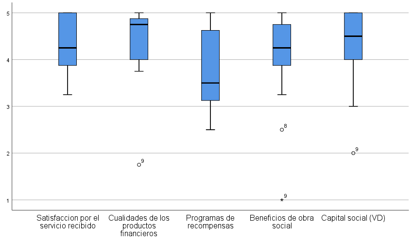
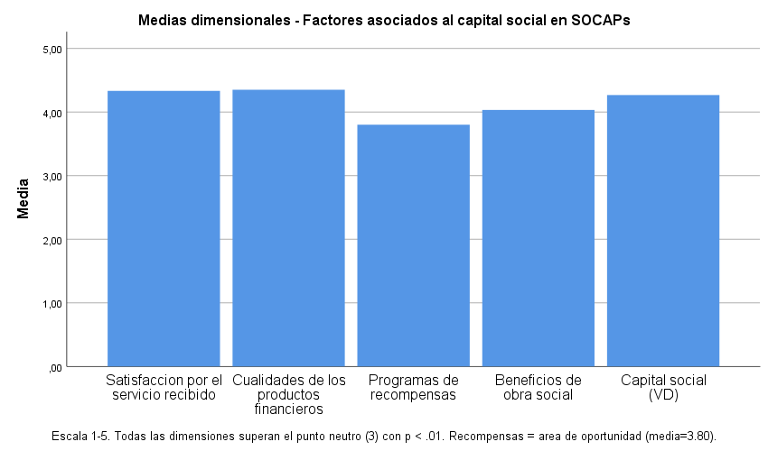
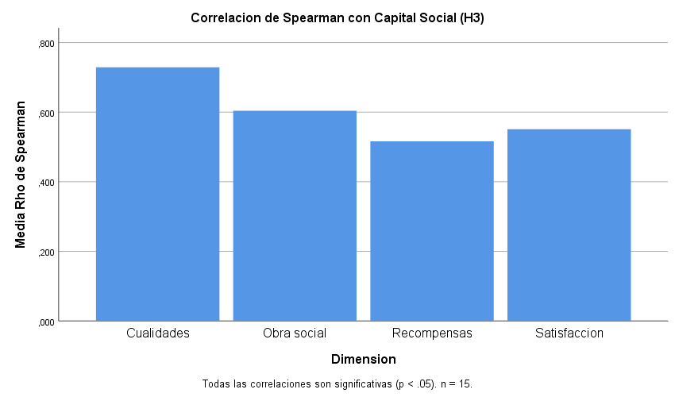

# Factores asociados al fortalecimiento del capital social en Sociedades Cooperativas de Ahorro y Préstamo: un estudio descriptivo-correlacional

## Resumen

El objetivo de este estudio es describir y analizar los factores asociados al fortalecimiento del capital social en Sociedades Cooperativas de Ahorro y Préstamo (SOCAPs) a partir de la evaluación de cuatro dimensiones: satisfacción por el servicio recibido, cualidades de los productos financieros, programas de recompensas y beneficios de obra social. Mediante un diseño cuantitativo, no experimental, transversal y de alcance descriptivo-correlacional, se aplicó un cuestionario estructurado a 15 directivos de SOCAPs. Los resultados indican que las cinco dimensiones evaluadas presentan una consistencia interna aceptable (α ≥ 0.826) y todas superan significativamente el punto neutro de la escala (p ≤ .004). La concordancia entre encuestados solo es significativa para la dimensión de Satisfacción (W = 0.316, p = .003). Se identifican correlaciones positivas y significativas entre las cuatro dimensiones independientes y el capital social (ρ = 0.516–0.729, p ≤ .049), destacando las cualidades de los productos financieros como el factor de mayor asociación. Los programas de recompensas constituyen el área de oportunidad principal. Se discuten las limitaciones del estudio y se proponen líneas para investigaciones futuras.

**Palabras clave:** capital social, SOCAPs, cooperativas de ahorro y préstamo, satisfacción del socio, Jalisco.

**Clasificación JEL:** G21, G32, Q14.

## 1. Introducción

Las Sociedades Cooperativas de Ahorro y Préstamo (SOCAPs) constituyen un pilar fundamental del sector financiero social en México, al facilitar el acceso al crédito y al ahorro en comunidades donde la banca tradicional tiene presencia limitada. En el estado de Jalisco, que concentra el mayor número de SOCAPs autorizadas por la Comisión Nacional Bancaria y de Valores (Sandoval & Alvirde, 2022), estas organizaciones enfrentan el desafío de fortalecer su capital social como mecanismo para garantizar su sostenibilidad y crecimiento.

La presente investigación tiene como objetivo general describir y analizar los factores asociados al fortalecimiento del capital social en las SOCAPs, a partir de la evaluación de cuatro dimensiones: satisfacción por el servicio recibido, cualidades de los productos financieros, programas de recompensas y beneficios de obra social.

Como objetivos específicos se plantean: (a) describir las características sociodemográficas de los directivos de las SOCAPs participantes en el estudio; (b) identificar las dimensiones con mayor y menor presencia percibida como áreas de oportunidad; (c) analizar la consistencia interna del instrumento y la concordancia entre las respuestas de los directivos; (d) explorar las relaciones entre las dimensiones evaluadas y el capital social; y (e) evaluar si los puntajes dimensionales se ubican por encima del punto neutro de la escala.

La hipótesis de trabajo plantea que las dimensiones evaluadas presentan patrones diferenciados de presencia en las SOCAPs estudiadas, y se identifican asociaciones exploratorias entre los factores analizados y el fortalecimiento del capital social. Las hipótesis operativas se resumen en la Tabla 1.

**Tabla 1**
*Hipótesis operativas*

| # | Hipótesis | Prueba estadística |
|:---|---|:---|
| H₁ | Las dimensiones evaluadas presentan puntajes promedio superiores al punto neutro de la escala (3 = "Ni de acuerdo ni en desacuerdo") | Prueba t para una muestra |
| H₂ | Existe concordancia entre las respuestas de los directivos dentro de cada dimensión | W de Kendall y chi-cuadrado |
| H₃ | Existe una relación positiva entre las dimensiones independientes (satisfacción, cualidades de productos, recompensas y obra social) y el capital social | Correlación de Spearman |

## 2. Marco teórico

### 2.1 Capital social: definición y dimensiones

El capital social se define como el conjunto de normas, redes y confianza que facilitan la acción colectiva y la cooperación en beneficio mutuo (Putnam, 1994). En el contexto de las organizaciones cooperativas, el capital social adquiere una relevancia particular, ya que estas entidades se fundamentan en principios de solidaridad, ayuda mutua y participación democrática. Desde la perspectiva organizacional, el capital social se manifiesta en la disposición de los miembros a contribuir al desarrollo de la organización, su sentido de pertenencia y su compromiso con los objetivos colectivos.

### 2.2 Las SOCAPs en México

Las SOCAPs son entidades de la economía social autorizadas por la CNBV que tienen como objetivo captar recursos de sus socios y otorgar créditos dentro del sector cooperativo. Su marco normativo se rige por la Ley General de Sociedades Cooperativas y la Ley para Regular las Actividades de las Sociedades Cooperativas de Ahorro y Préstamo (Cruz Lázaro & Pérez Sosa, 2020). Jalisco concentra el mayor número de SOCAPs autorizadas en México, lo que convierte a la región en un contexto relevante para el estudio del fortalecimiento del capital social en este tipo de organizaciones (Sandoval & Alvirde, 2022).

### 2.3 Factores asociados al fortalecimiento del capital social

**Satisfacción por el servicio recibido.** La calidad del servicio percibida por los socios constituye un factor fundamental para el fortalecimiento del capital social. Pineda y Ramírez (2023), en un estudio sobre Caja Popular Mexicana, encontraron que la satisfacción del socio se relaciona positivamente con la intención de recomendación y la permanencia en la cooperativa.

**Cualidades de los productos financieros.** La accesibilidad, competitividad y diversidad de los productos financieros ofrecidos por las SOCAPs determinan en gran medida la percepción de valor por parte de los socios. Mejía-Trejo y Fregoso-Jasso (2012) identificaron que la innovación en servicios y la adaptación de los productos financieros a las necesidades de los socios son factores clave para la permanencia y el crecimiento de las cajas populares en Jalisco.

**Programas de recompensas.** Los programas de recompensas, que incluyen incentivos económicos, beneficios preferenciales, reconocimientos y programas de fidelización, constituyen un mecanismo para reforzar el vínculo entre el socio y la cooperativa.

**Beneficios de obra social.** Las SOCAPs, como entidades de la economía social, tienen un compromiso con el desarrollo comunitario. Cobián Puebla et al. (2022) destacan que el balance social cooperativo incluye variables como el apoyo educativo, los programas comunitarios y la responsabilidad social cooperativa, que contribuyen a generar un sentido de pertenencia y compromiso entre los socios.

### 2.4 Medición del capital social en cooperativas

Cobián Puebla, Rosales Adame y colaboradores (2021, 2022) proponen indicadores específicos para el balance social cooperativo en el sector de ahorro y préstamo mexicano, utilizando escalas Likert para capturar las percepciones de los directivos sobre el impacto social de las cooperativas. Estudios previos en el contexto de las SOCAPs han utilizado encuestas a directivos como fuente primaria de información, dado que su conocimiento y experiencia les permite evaluar de manera integral los factores que inciden en el fortalecimiento del capital social (Cruz Lázaro & Pérez Sosa, 2020; Sandoval & Alvirde, 2022).

## 3. Metodología

### 3.1 Diseño de investigación

La investigación se concibe bajo un diseño no experimental, transversal y de campo, con enfoque cuantitativo y alcance descriptivo-correlacional (Hernández-Sampieri & Mendoza, 2018). Las variables se observan en su contexto natural sin manipulación deliberada, y la información se recoge en un único momento del tiempo. El alcance es descriptivo porque caracteriza las prácticas y percepciones de los directivos en cada dimensión evaluada; es correlacional porque explora las relaciones entre las variables independientes y el capital social.

### 3.2 Población y muestra

La muestra está conformada por 15 directivos de SOCAPs encuestados. La caracterización demográfica se presenta en la Tabla 2.

**Tabla 2**
*Caracterización de la muestra*

| Variable | Categorías | *n* | % |
|:---|---|---|:---:|
| Sexo | Femenino | 6 | 40.0 |
| | Masculino | 9 | 60.0 |
| Edad (años) | Media (DE) | 45.5 (4.8) | |
| | Rango | 41–58 | |
| Escolaridad | Universitaria | 6 | 40.0 |
| | Maestría | 9 | 60.0 |
| Antigüedad como funcionario (años) | Media (DE) | 20.3 (4.2) | |
| | Rango | 12–28 | |

Se empleó un muestreo no probabilístico del tipo muestra razonada, que contempla la participación de directivos que, por sus conocimientos y experiencia práctica, pueden aportar información relevante sobre el fortalecimiento del capital social. Las respuestas se recolectaron mediante un formulario digital (Google Forms).

### 3.3 Instrumento

El instrumento es un cuestionario estructurado que utiliza escala Likert de 5 puntos (1 = Totalmente en desacuerdo, 5 = Totalmente de acuerdo). Evalúa cinco dimensiones a través de 18 ítems, más cuatro variables de caracterización (sexo, edad, escolaridad, antigüedad como funcionario). La estructura del instrumento se detalla en la Tabla 3.

**Tabla 3**
*Dimensiones e ítems del instrumento*

| Dimensión | Ítems | Código | N.º de ítems |
|:---|---|---|:---:|
| Satisfacción por el servicio recibido | Calidad de la atención al socio, Rapidez en la prestación de servicios, Solución de problemas, Profesionalismo del personal | sat_01–sat_04 | 4 |
| Cualidades de los productos financieros | Accesibilidad, Competitividad, Diversidad de productos, Flexibilidad de condiciones | cual_01–cual_04 | 4 |
| Programas de recompensas | Incentivos económicos, Beneficios preferenciales, Reconocimientos, Programas de fidelización | recom_01–recom_04 | 4 |
| Beneficios de obra social | Apoyo educativo, Programas comunitarios, Actividades sociales, Responsabilidad social cooperativa | obra_01–obra_04 | 4 |
| Capital social (VD) | Disposición para incrementar aportaciones, Permanencia y crecimiento de socios | cs_01–cs_02 | 2 |

No se requirió inversión de ítems negativos, ya que todos los reactivos están redactados en sentido positivo.

### 3.4 Variables y operacionalización

Cada dimensión se operacionaliza como el promedio de sus ítems constituyentes. Las variables demográficas incluyen sexo (nominal dicotómica), edad (razón en años), escolaridad (nominal) y antigüedad como funcionario (razón en años).

### 3.5 Procedimiento de limpieza y preprocesamiento

La base original contenía 15 filas y 23 columnas. El preprocesamiento se realizó mediante `src/clean.py` aplicando estandarización de edad y antigüedad a enteros y limpieza de etiquetas. Todos los valores Likert se encuentran en rango 1–5.

### 3.6 Análisis estadístico

El análisis se desarrolla en seis etapas, alineadas con estudios similares sobre capital social en el sector cooperativo de ahorro y préstamo (Cobián Puebla et al., 2022; Pineda & Ramírez, 2023):

1. **Estadística descriptiva**: frecuencias absolutas y relativas, moda y mediana para todos los ítems. Tablas de 9 columnas (Ítem, Dimensión, Descripción, 5, 4, 3, 2, 1, Moda).
2. **Consistencia interna**: Alfa de Cronbach por dimensión (umbral ≥ 0.70; Tavakol & Dennick, 2011).
3. **Concordancia**: W de Kendall + chi-cuadrado para evaluar el acuerdo entre encuestados dentro de cada dimensión.
4. **Prueba de hipótesis para una muestra (H₁)**: prueba t contra el valor neutro (3), α = 0.05, dos colas.
5. **Correlaciones de Spearman (H₃)**: ρ entre dimensiones independientes y capital social.
6. **Análisis exploratorio**: examen de intercorrelaciones entre dimensiones independientes.

El análisis se realizó en IBM SPSS Statistics v.26. Con n = 15, la potencia estadística es limitada; solo se detectan correlaciones grandes (ρ > |0.51|) con suficiente potencia.

### 3.7 Consideraciones éticas

La participación fue voluntaria y anónima. La base analítica no incluye nombres ni datos que permitan identificar individualmente a los participantes. No se registró la SOCAP de pertenencia de cada directivo. Los datos se utilizan con fines de investigación.

## 4. Resultados

### 4.1 Consistencia interna

Se calculó el coeficiente Alfa de Cronbach para cada dimensión. Los resultados se presentan en la Tabla 4.

**Tabla 4**
*Consistencia interna por dimensión*

| Dimensión | Alfa de Cronbach | N.º de ítems |
|:---|---|:---:|
| Satisfacción por el servicio recibido | 0.912 | 4 |
| Cualidades de los productos financieros | 0.870 | 4 |
| Programas de recompensas | 0.855 | 4 |
| Beneficios de obra social | 0.938 | 4 |
| Capital social (VD) | 0.826 | 2 |

Las cinco dimensiones superan el umbral de 0.70, lo que indica una consistencia interna aceptable a buena. La dimensión de Capital social (2 ítems) alcanza un alfa de 0.826, valor adecuado considerando el número reducido de reactivos (Tavakol & Dennick, 2011). La dimensión con mayor fiabilidad es Obra social (α = 0.938) y la de menor es Recompensas (α = 0.855).

### 4.2 Análisis descriptivo por ítem

La Tabla 5 presenta los estadísticos descriptivos —frecuencias absolutas y relativas para cada nivel de la escala Likert, y moda— de los 18 ítems que componen el instrumento. Se observa un marcado efecto techo: la mayoría de las respuestas se concentran en las categorías 4 ("De acuerdo") y 5 ("Totalmente de acuerdo"), con muy pocas o ninguna respuesta en los niveles inferiores de la escala.

**Tabla 5**
*Frecuencias por ítem*

| Ítem | Dimensión | Descripción | 5 | 4 | 3 | 2 | 1 | Moda |
|:-----|:----------|:---------------------------|-------:|-------:|-------:|-------:|-------:|:----:|
| sat_01 | Satisfacción | Calidad de la atención al socio | 7 (46.7) | 8 (53.3) | — | — | — | 4 |
| sat_02 | Satisfacción | Rapidez en la prestación de servicios | 5 (33.3) | 6 (40.0) | 3 (20.0) | 1 (6.7) | — | 4 |
| sat_03 | Satisfacción | Solución de problemas | 8 (53.3) | 6 (40.0) | 1 (6.7) | — | — | 5 |
| sat_04 | Satisfacción | Profesionalismo del personal | 6 (40.0) | 9 (60.0) | — | — | — | 4 |
| cual_01 | Cualidades | Accesibilidad | 11 (73.3) | 3 (20.0) | 1 (6.7) | — | — | 5 |
| cual_02 | Cualidades | Competitividad | 7 (46.7) | 7 (46.7) | — | — | 1 (6.7) | 4¹ |
| cual_03 | Cualidades | Diversidad de productos | 10 (66.7) | 3 (20.0) | 1 (6.7) | — | 1 (6.7) | 5 |
| cual_04 | Cualidades | Flexibilidad de condiciones | 6 (40.0) | 6 (40.0) | 2 (13.3) | — | 1 (6.7) | 4¹ |
| recom_01 | Recompensas | Incentivos económicos | 5 (33.3) | 5 (33.3) | 2 (13.3) | 3 (20.0) | — | 4¹ |
| recom_02 | Recompensas | Beneficios preferenciales | 5 (33.3) | 5 (33.3) | 5 (33.3) | — | — | 3¹ |
| recom_03 | Recompensas | Reconocimientos | 4 (26.7) | 5 (33.3) | 5 (33.3) | — | 1 (6.7) | 3¹ |
| recom_04 | Recompensas | Programas de fidelización | 4 (26.7) | 5 (33.3) | 4 (26.7) | 1 (6.7) | 1 (6.7) | 4 |
| obra_01 | Obra social | Apoyo educativo | 9 (60.0) | 4 (26.7) | — | 1 (6.7) | 1 (6.7) | 5 |
| obra_02 | Obra social | Programas comunitarios | 6 (40.0) | 4 (26.7) | 2 (13.3) | 2 (13.3) | 1 (6.7) | 5 |
| obra_03 | Obra social | Actividades sociales | 4 (26.7) | 8 (53.3) | 1 (6.7) | 1 (6.7) | 1 (6.7) | 4 |
| obra_04 | Obra social | Responsabilidad social cooperativa | 7 (46.7) | 6 (40.0) | 1 (6.7) | — | 1 (6.7) | 5 |
| cs_01 | Capital social | Disposición para incrementar aportaciones | 8 (53.3) | 5 (33.3) | 2 (13.3) | — | — | 5 |
| cs_02 | Capital social | Permanencia y crecimiento de socios | 6 (40.0) | 7 (46.7) | 1 (6.7) | — | 1 (6.7) | 4 |

*Nota.* Cada celda de los niveles 5 a 1 muestra la frecuencia absoluta y, entre paréntesis, el porcentaje. 5 = Totalmente de acuerdo; 4 = De acuerdo; 3 = Ni de acuerdo ni en desacuerdo; 2 = En desacuerdo; 1 = Totalmente en desacuerdo. *n* = 15 para todos los ítems.
¹ Múltiples modas; se muestra el valor más pequeño.

Los ítems con mayor presencia percibida (moda = 5) son: Accesibilidad (cual_01; 73.3 % en 5), Diversidad de productos (cual_03; 66.7 %), Apoyo educativo (obra_01; 60.0 %), Solución de problemas (sat_03; 53.3 %) y Disposición para incrementar aportaciones (cs_01; 53.3 %). Los ítems con presencia más moderada corresponden a la dimensión de Recompensas, con frecuencias notables en la categoría 3, especialmente Beneficios preferenciales (recom_02; 33.3 % en 3) y Reconocimientos (recom_03; 33.3 % en 3).

La Figura 1 presenta el box-plot comparativo de las cinco dimensiones, donde se aprecia la concentración de puntajes en valores altos y la variabilidad relativa de cada dimensión.

**Figura 1**
*Box-plot comparativo de las dimensiones evaluadas*

### 4.3 Prueba de hipótesis para una muestra (H₁)

**H₁: Las dimensiones evaluadas presentan puntajes promedio superiores al punto neutro de la escala (3).**

Se aplicó una prueba t para una muestra contra el valor 3 (neutro). Los resultados se presentan en la Tabla 6.

**Tabla 6**
*Prueba t para una muestra contra el valor neutro (3)*

| Dimensión | Media | DE | t | gl | p | Diferencia | IC 95 % |
|:---|---|---|:---:|:---:|:---:|:---:|:---:|
| Satisfacción | 4.33 | 0.60 | 8.677 | 14 | < .001 | 1.33 | [1.00, 1.66] |
| Cualidades | 4.35 | 0.84 | 6.233 | 14 | < .001 | 1.35 | [0.89, 1.81] |
| Recompensas | 3.80 | 0.90 | 3.453 | 14 | .004 | 0.80 | [0.30, 1.30] |
| Obra social | 4.03 | 1.09 | 3.661 | 14 | .003 | 1.03 | [0.43, 1.64] |
| Capital social | 4.27 | 0.84 | 5.824 | 14 | < .001 | 1.27 | [0.80, 1.73] |

**Resultado: H₁ se acepta para las cinco dimensiones.** Todas presentan medias significativamente superiores al punto neutro (p ≤ .004). Cualidades y Satisfacción muestran las mayores diferencias (1.35 y 1.33, respectivamente), mientras que Recompensas presenta la diferencia más moderada (0.80). La Figura 2 visualiza esta jerarquía de medias.

**Figura 2**
*Medias dimensionales con punto neutro de referencia*

### 4.4 Concordancia entre encuestados (H₂)

**H₂: Existe concordancia entre las respuestas de los directivos dentro de cada dimensión.**

Se aplicó el coeficiente W de Kendall junto con la prueba de chi-cuadrado. Los resultados se presentan en la Tabla 7.

**Tabla 7**
*Coeficiente W de Kendall por dimensión*

| Dimensión | W de Kendall | χ² | gl | p |
|:---|:---:|:---:|:---:|:---:|
| Satisfacción | 0.316 | 14.234 | 3 | .003 |
| Cualidades | 0.159 | 7.141 | 3 | .068 |
| Recompensas | 0.026 | 1.177 | 3 | .758 |
| Obra social | 0.163 | 7.350 | 3 | .062 |
| Capital social | 0.120 | 1.800 | 1 | .180 |

**Resultado: H₂ se acepta únicamente para la dimensión de Satisfacción** (W = 0.316, χ² = 14.234, p = .003). Este hallazgo indica que existe un patrón de respuesta compartido entre los directivos respecto a la calidad del servicio. Las dimensiones de Cualidades (p = .068) y Obra social (p = .062) se aproximan al umbral de significación sin alcanzarlo. Con n = 15, la potencia estadística de la prueba de Kendall es limitada (Siegel & Castellan, 1988), por lo que estos resultados no descartan la existencia de concordancia. Las dimensiones de Recompensas (p = .758) y Capital social (p = .180) no presentan evidencia de concordancia.

### 4.5 Relaciones entre dimensiones y capital social (H₃)

**H₃: Existe una relación positiva entre las dimensiones independientes y el capital social.**

Se aplicó el coeficiente de correlación de Spearman (rho). Todos los coeficientes son positivos y significativos (Tabla 8).

**Tabla 8**
*Correlaciones de Spearman entre dimensiones independientes y capital social*

| Dimensión | ρ con Capital social | p |
|:---|---|:---:|
| Satisfacción | 0.551 | .033 |
| Cualidades | 0.729 | .002 |
| Recompensas | 0.516 | .049 |
| Obra social | 0.604 | .017 |

**Resultado: H₃ se acepta para las cuatro dimensiones.** La asociación más fuerte se observa entre Cualidades y Capital social (ρ = 0.729, p = .002), seguida de Obra social (ρ = 0.604, p = .017) y Satisfacción (ρ = 0.551, p = .033). Recompensas presenta la correlación más débil (ρ = 0.516, p = .049). La Figura 3 presenta estas correlaciones de forma gráfica.

**Figura 3**
*Correlación de Spearman de cada dimensión con Capital social*

Es importante señalar que las correlaciones entre las dimensiones independientes son muy elevadas (ρ ≥ 0.777 entre todos los pares, con varios pares superando 0.90), lo que sugiere la posible existencia de un factor subyacente común. Este hallazgo es consistente con la literatura que señala que la evaluación de la gestión cooperativa tiende a ser holística (Pineda & Ramírez, 2023).

### 4.6 Resumen de resultados

La Tabla 9 sintetiza los resultados de las tres hipótesis operativas.

**Tabla 9**
*Resumen de resultados por hipótesis*

| Hipótesis | Prueba | Resultado | Valor clave |
|:---|:---|---|:---:|
| H₁: Medias > 3 | t para una muestra | Aceptada (5/5 dimensiones) | p ≤ .004 |
| H₂: Concordancia | W de Kendall | Aceptada parcialmente (1/5 dimensiones) | Solo Satisfacción, p = .003 |
| H₃: ρ > 0 con CS | Spearman | Aceptada (4/4 dimensiones) | ρ = 0.516–0.729, p ≤ .049 |

## 5. Conclusiones

### 5.1 Discusión de hallazgos

El presente estudio describe y analiza los factores asociados al fortalecimiento del capital social en SOCAPs a partir de las percepciones de 15 directivos. Los resultados indican que el capital social se percibe como fortalecido (media = 4.27/5, significativamente superior al neutro), y que las cuatro dimensiones evaluadas —satisfacción, cualidades de productos, recompensas y obra social— se asocian positiva y significativamente con él.

La satisfacción por el servicio recibido emerge como la dimensión más robusta del estudio: presenta la mayor consistencia interna (α = 0.912), la concordancia más alta y significativa (W = 0.316, p = .003), y una correlación significativa con el capital social (ρ = 0.551, p = .033). Estos resultados coinciden con Pineda y Ramírez (2023), quienes encontraron que la satisfacción del socio en Caja Popular Mexicana se relaciona positivamente con la intención de recomendación y la permanencia en la cooperativa.

Las cualidades de los productos financieros muestran la asociación más fuerte con el capital social (ρ = 0.729, p = .002). La accesibilidad (73.3 % en "Totalmente de acuerdo") y la diversidad de productos (66.7 %) destacan como los atributos mejor valorados. Mejía-Trejo y Fregoso-Jasso (2012) ya habían identificado la innovación en servicios financieros como un factor clave para la permanencia de las cajas populares en Jalisco, y los presentes hallazgos refuerzan esa evidencia.

Los programas de recompensas constituyen el área de oportunidad más clara. Con la media más baja (3.80), la concordancia más débil (W = 0.026, p = .758) y la correlación más moderada con el capital social (ρ = 0.516, p = .049), esta dimensión sugiere que las SOCAPs estudiadas no han desarrollado plenamente esquemas formales de incentivos y fidelización. Este hallazgo es consistente con la literatura: las cooperativas de ahorro y préstamo en México tienden a concentrar sus esfuerzos en la calidad del servicio y la obra social, dejando los programas de recompensas en un segundo plano (Cobián Puebla et al., 2022; Sandoval & Alvirde, 2022).

La obra social se perfila como un factor relevante para el fortalecimiento del capital social (ρ = 0.604, p = .017), coherente con el principio cooperativo de compromiso con la comunidad. El apoyo educativo (60.0 % en "Totalmente de acuerdo") destaca como el ítem con mayor presencia en esta dimensión, lo que respalda la literatura sobre el balance social cooperativo como un componente diferenciador de las cooperativas frente a la banca tradicional (Cobián Puebla et al., 2022).

Un hallazgo transversal relevante son las altas intercorrelaciones entre las dimensiones independientes (ρ ≥ 0.777), que sugieren la posible existencia de un factor subyacente común o una evaluación holística por parte de los directivos. Este patrón, aunque no invalida los hallazgos, limita la capacidad de discriminar el efecto único de cada variable y recomienda, para estudios futuros, la inclusión de un análisis factorial confirmatorio con muestras más amplias.

### 5.2 Limitaciones

Los hallazgos deben interpretarse a la luz de las siguientes limitaciones:

1. **Tamaño muestral reducido (n = 15):** limita la potencia estadística de las pruebas inferenciales. Solo se detectan efectos grandes; los efectos moderados o pequeños pueden pasar inadvertidos. Los resultados deben considerarse exploratorios.
2. **Muestreo no probabilístico:** no permite generalización estadística a todas las SOCAPs. Los hallazgos son contextuales.
3. **Capital social con solo 2 ítems:** la medición de la variable dependiente con únicamente dos reactivos limita su fiabilidad y validez de contenido.
4. **Sin identificador de SOCAP:** la base de datos no registra a cuál SOCAP pertenece cada directivo, lo que impide analizar efectos de agrupamiento.
5. **Efecto techo:** las respuestas se concentran en valores altos de la escala (4 y 5), reduciendo la variabilidad y la capacidad de detectar relaciones.
6. **Sesgo de auto-reporte:** la información proviene de la declaración de los encuestados, sujeta a deseabilidad social.
7. **Diseño transversal:** medición en un único momento, sin capturar cambios temporales.
8. **Altas intercorrelaciones entre dimensiones independientes:** sugiere posible colinealidad o la existencia de un factor común.
9. **Validación de constructo no confirmada:** la estructura de cinco dimensiones no fue sometida a análisis factorial. Con n = 15 y 18 ítems, el tamaño muestral es insuficiente (se requieren al menos 5–10 casos por ítem para obtener una matriz de correlaciones estable).

### 5.3 Recomendaciones

**Para la práctica cooperativa:** (a) fortalecer los programas de recompensas como área de oportunidad prioritaria; (b) mantener y potenciar la calidad del servicio, dimensión más robusta del estudio; (c) consolidar la obra social como factor diferenciador; y (d) diversificar y flexibilizar la oferta de productos financieros.

**Para futuras investigaciones:** (a) incrementar el tamaño muestral para permitir análisis multivariantes; (b) incluir un identificador de SOCAP para analizar efectos de agrupamiento; (c) ampliar la medición del capital social con más ítems; (d) realizar un análisis factorial confirmatorio para validar la estructura dimensional; (e) incorporar variables de desempeño objetivo como complemento a la percepción de los directivos; y (f) considerar un diseño longitudinal para evaluar la evolución del capital social en el tiempo.

## Referencias

Cobián Puebla, A., Rosales Adame, J. J., & Sánchez, Y. (2021). Indicadores del Balance Social Cooperativo para el sector de ahorro y préstamo mexicano. *Cooperativismo y Desarrollo*, 29(120).

Cobián Puebla, A., Rosales Adame, J. J., & Sánchez, Y. (2022). El balance social cooperativo y sus variables para el sector de ahorro y crédito mexicano. *Cofin Habana*, 16(1).

Cruz Lázaro, L. M. & Pérez Sosa, F. A. (2020). *Evaluación de la estructura de capital de las Sociedades Cooperativas de Ahorro y Préstamo de México* [Tesis doctoral, Universidad Complutense de Madrid].

Hernández-Sampieri, R. & Mendoza, C. (2018). *Metodología de la investigación: las rutas cuantitativa, cualitativa y mixta*. McGraw-Hill.

Mejía-Trejo, J. & Fregoso-Jasso, G. (2012). Innovación en servicios como base para la permanencia y crecimiento de las cajas populares de las regiones de Sierra de Amula y Costa Sur del estado de Jalisco. *SSRN Electronic Journal*.

Pineda, M. D. S. & Ramírez, F. C. S. (2023). La satisfacción y su relación con la intención de recomendación de boca en boca de las sociedades cooperativas de ahorro y préstamo: caso Caja Popular Mexicana. *Cooperativismo & Desarrollo*, 31(127).

Putnam, R. D. (1994). *Making democracy work: Civic traditions in modern Italy*. Princeton University Press.

Sandoval, I. M. L. & Alvirde, E. L. (2022). Factores que condicionan el desarrollo y el crecimiento de las sociedades cooperativas de ahorro y préstamo en México. *Denarius*, (42), 175–201.

Siegel, S. & Castellan, N. J. (1988). *Nonparametric statistics for the behavioral sciences* (2.ª ed.). McGraw-Hill.

Tavakol, M. & Dennick, R. (2011). Making sense of Cronbach's alpha. *International Journal of Medical Education*, 2, 53–55.
